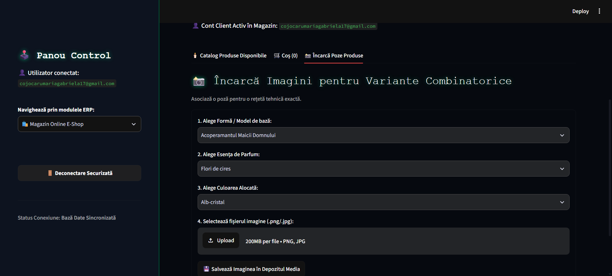
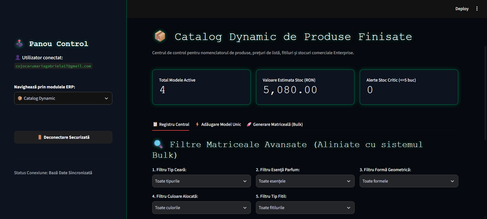
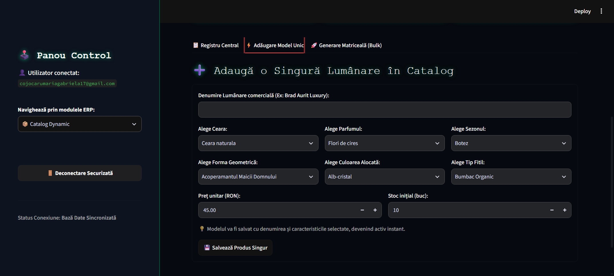
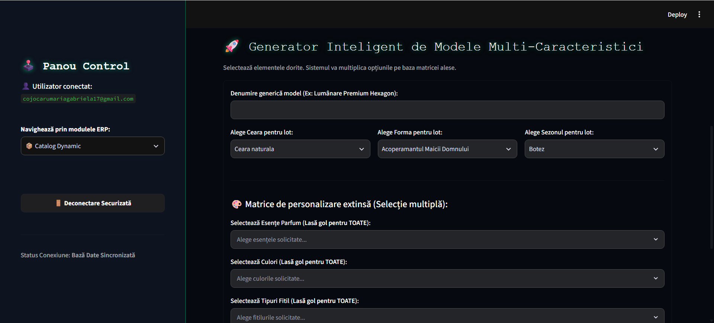
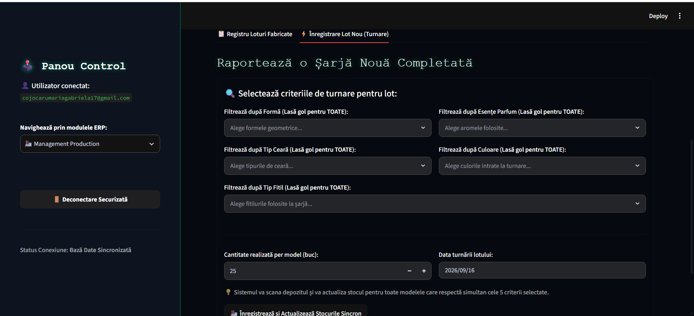
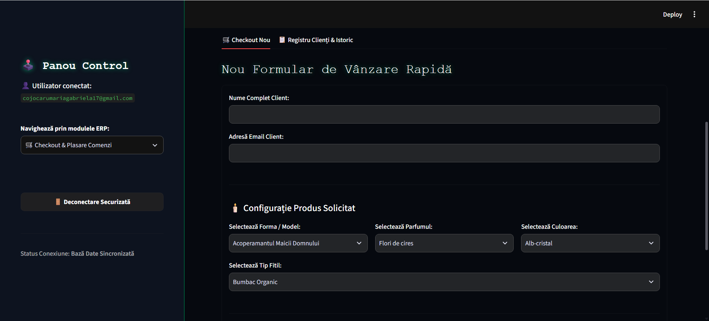
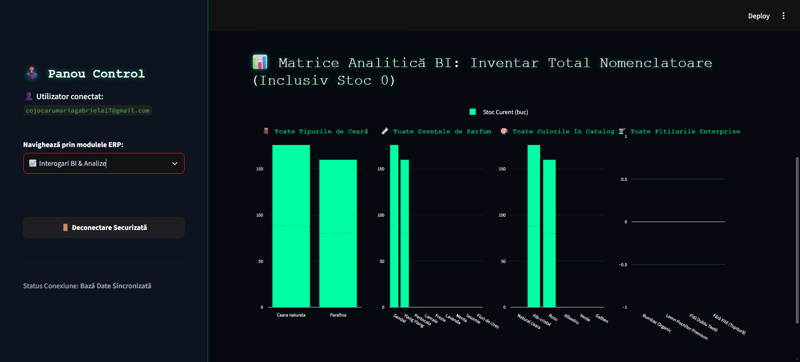
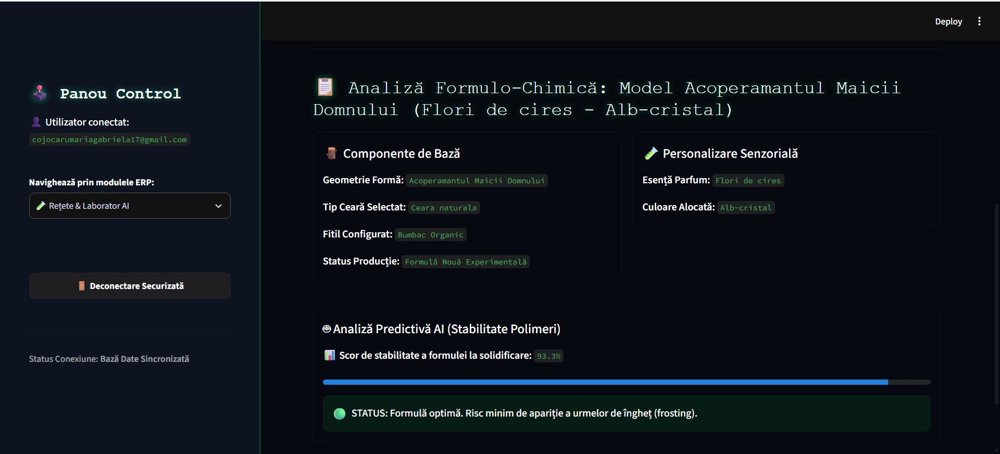

# ⚡ Light Infinity AI — Enterprise ERP & BI System

**Light Infinity AI** is a modular Enterprise Resource Planning (ERP) and Business Intelligence (BI) platform designed for artisan candle manufacturing, product catalog management, production tracking, sales operations, invoicing, and analytical reporting.

The application combines a relational database architecture, modular Python services, Streamlit interfaces, Alembic migrations, automated PDF generation, analytical dashboards, and an AI-oriented laboratory simulation layer.

The project is designed as a **portfolio-grade enterprise application**, with a clear separation between database models, infrastructure, business modules, analytics, storefront operations, and application presentation.

---

## 🏗️ Architecture Overview

The system follows a modular layered architecture:

```text
                           ┌──────────────────────────────┐
                           │        Streamlit UI          │
                           │         dashboard.py        │
                           └──────────────┬───────────────┘
                                          │
                    ┌─────────────────────┼─────────────────────┐
                    │                     │                     │
                    ▼                     ▼                     ▼
             Storefront              ERP Modules          BI / Laboratory
             storefront              products             bi
                                     orders               laborator
                                     production
                    │                     │                     │
                    └─────────────────────┼─────────────────────┘
                                          │
                                          ▼
                              ┌────────────────────────┐
                              │   Application Core     │
                              │   app/core/base.py     │
                              └────────────┬───────────┘
                                           │
                                           ▼
                              ┌────────────────────────┐
                              │ Database Infrastructure │
                              │ app/db/connection.py   │
                              └────────────┬───────────┘
                                           │
                                           ▼
                              ┌────────────────────────┐
                              │ SQLAlchemy / SQLite    │
                              │ PostgreSQL compatible  │
                              └────────────────────────┘

             Alembic
                │
                ▼
       Database Schema Versioning

             Tests
                │
                ▼
       pytest + Ruff + Promptfoo
```

### Architectural principles

* **Modularity** — each business domain is implemented in a dedicated module.
* **Separation of concerns** — database models, infrastructure, business logic, and UI are kept separate.
* **Database version control** — schema changes are managed through Alembic.
* **Testability** — core relationships and validation rules are covered by automated tests.
* **Environment isolation** — local databases, virtual environments, secrets, generated invoices, and caches are excluded from Git.
* **Extensibility** — the application can evolve from local SQLite development toward PostgreSQL-based deployments.

---

## 📁 Project Structure

```text
light_infinity_ai_enterprise_erp/
│
├── app/                                      # Main application package
│   ├── core/                                 # Core domain and shared application logic
│   │   └── base.py                           # Central SQLAlchemy ORM models and relationships
│   │
│   ├── db/                                   # Database infrastructure
│   │   └── connection.py                     # Database engine, sessions, environment configuration
│   │
│   ├── modules/                              # Business-domain modules
│   │   ├── bi/                               # Business Intelligence module
│   │   │   └── bi_module.py                  # KPIs, analytics and Plotly visualizations
│   │   │
│   │   ├── laborator/                        # AI / manufacturing simulation module
│   │   │   └── laborator_module.py           # Production simulations and calculated stability indicators
│   │   │
│   │   ├── orders/                           # Sales and invoicing module
│   │   │   └── orders_module.py               # Orders, stock updates and PDF invoice generation
│   │   │
│   │   ├── production/                       # Manufacturing management module
│   │   │   └── production_module.py          # Production batches, quantities and material tracking
│   │   │
│   │   ├── products/                         # Product catalog management
│   │   │   └── products_module.py            # Product registry, pricing, stock and bulk generation
│   │   │
│   │   └── storefront/                       # Customer-facing e-commerce module
│   │       └── storefront_module.py          # Product catalog, shopping cart and checkout workflow
│   │
│   ├── __init__.py                           # Marks app/ as a Python package
│   └── main.py                               # Main Python application entry point
│
├── migrations/                               # Alembic database migration system
│   ├── versions/                             # Version-controlled database schema changes
│   │   └── 6fb934a941a5_creare_arhitectura_impecabila_lumanari.py
│   │                                           # Initial enterprise database schema migration
│   └── env.py                                # Alembic environment and database configuration
│
├── tests/                                    # Automated test suite
│   ├── conftest.py                           # Test environment and Python path configuration
│   └── test_models.py                        # ORM relationship and model validation tests
│
├── assets/                                   # Application screenshots and visual resources
│   ├── assetsai_laboratory_polymers_sim.png  # AI Laboratory interface screenshot
│   ├── assetsbi_analytics_4d_subplots.png    # Business Intelligence dashboard screenshot
│   ├── assetscatalog_add_single_product.png  # Single-product creation interface
│   ├── assetscatalog_bulk_matrix_generator.png# Bulk product generation interface
│   ├── assetscatalog_central_registry.png    # Central product registry interface
│   ├── assetseshop_catalog_grid.png          # E-Shop product catalog screenshot
│   ├── assetseshop_media_uploader.png        # E-Shop media management interface
│   └── assetsproduction_batch_launcher.png   # Production batch management interface
│
├── .streamlit/                              # Streamlit application configuration
│   └── config.toml                            # Custom UI theme and Streamlit settings
│
├── dashboard.py                              # Main Streamlit dashboard, authentication and module router
├── seed.py                                   # Initial database seeding and catalog population
├── promptfoo.yaml                            # Promptfoo configuration for AI evaluation
├── alembic.ini                               # Alembic configuration entry point
├── pyproject.toml                             # Python project metadata and dependencies
├── uv.lock                                    # Deterministic dependency lock file
├── README.md                                  # Project documentation and architecture reference
└── .gitignore                                 # Excludes secrets, databases, caches and generated files
```
---

# 🧩 Core Components

## `dashboard.py`

The main Streamlit application interface and central application router.

Responsibilities include:

* authentication flow;
* session management;
* navigation between ERP modules;
* global application configuration;
* rendering the main dashboard;
* controlling access to protected application sections.

The dashboard acts as the presentation layer connecting the user interface with the modular business components.

---

## `app/main.py`

Application entry point for the Python application layer.

It provides the centralized startup location for the application package and keeps the project entry architecture separate from the Streamlit dashboard.

---

## `app/core/base.py`

The central SQLAlchemy domain model registry.

This file contains the active ORM models and relationships used by the application.

### Main entities

```text
Ceara
   │
   └── Lumanare

Sezon
   │
   └── Lumanare

Forma
   │
   └── Lumanare

Parfum
   │
   └── Lumanare

Culoare
   │
   └── Lumanare

Lumanare
   ├── ComandaLumanare
   └── Productie

Client
   │
   └── Comanda
          │
          └── ComandaLumanare

Material
   │
   └── ConsumMateriale

Productie
   │
   └── ConsumMateriale
```

The model layer currently defines the following database tables:

```text
ceara
sezoane
forme
parfumuri
culori
lumanari
clienti
comenzi
pivot_comanda_lumanare
materiale
productie
consum_materiale
```

This centralized model architecture prevents duplicate ORM definitions across individual modules.

---

# 🗄️ Database Layer

## `app/db/connection.py`

Central database infrastructure.

Responsibilities:

* loads environment variables;
* reads `DATABASE_URL`;
* provides a local SQLite fallback;
* converts PostgreSQL URLs to the SQLAlchemy psycopg2 driver format;
* creates the SQLAlchemy engine;
* configures connection pooling for non-SQLite databases;
* exposes `SessionLocal`;
* provides the `get_db()` dependency.

### Development database

```text
SQLite
└── local_erp.db
```

### Production-oriented compatibility

The connection layer also supports PostgreSQL through:

```text
postgresql://...
```

which is normalized internally to:

```text
postgresql+psycopg2://...
```

This allows the application to use SQLite during local development while keeping the database layer compatible with a PostgreSQL deployment.

---

# 🔄 Database Migrations

The project uses **Alembic** for database schema version control.

```text
migrations/
├── env.py
└── versions/
    └── 6fb934a941a5_creare_arhitectura_impecabila_lumanari.py
```

The initial enterprise migration creates the complete relational schema, including:

* nomenclature tables;
* candle catalog;
* customer records;
* orders;
* order line items;
* production batches;
* materials;
* material consumption records.

### Apply migrations

```bash
uv run alembic upgrade head
```

### Roll back to the empty schema

```bash
uv run alembic downgrade base
```

### Validate migration synchronization

```bash
uv run alembic check
```

The migration architecture has been validated in both directions:

```text
upgrade head  → successful
downgrade base → successful
alembic check → no new upgrade operations detected
```

---

# 🛍️ ERP Modules

## 1. 🛒 Storefront — `storefront_module.py`

The storefront module provides the customer-facing product selection and cart workflow.

### Responsibilities

* candle configuration;
* product selection;
* wax, scent, color, mold and seasonal attributes;
* session-based shopping cart;
* stock validation;
* unified checkout;
* order creation.

The cart is maintained in Streamlit session state before the final transaction is committed to the database.

---

## 2. 📦 Product Management — `products_module.py`

Central product catalog administration.

### Responsibilities

* product registry;
* product attribute selection;
* pricing management;
* inventory management;
* inline data editing;
* bulk product generation;
* previewing generated records before database insertion.

The module works directly with the centralized ORM models from:

```text
app/core/base.py
```

This avoids maintaining separate model definitions inside the module.

---

## 3. 🏭 Production Management — `production_module.py`

Manufacturing and production tracking.

### Responsibilities

* production batch creation;
* candle selection;
* production quantities;
* inventory increases;
* production history;
* material-consumption tracking;
* operational production metrics.

Production records are connected to the central `Lumanare` entity and can be associated with consumed materials through `ConsumMateriale`.

---

## 4. 🧾 Orders & Invoicing — `orders_module.py`

Sales transaction and invoice management.

### Responsibilities

* direct sales entry;
* customer management;
* order creation;
* order line management;
* stock reduction;
* invoice generation;
* invoice history;
* PDF download.

PDF documents are generated using **ReportLab**.

Generated invoice files are stored locally under:

```text
autogen_facturi/
```

This directory is intentionally excluded from Git because invoices are generated runtime artifacts.

---

## 5. 📈 Business Intelligence — `bi_module.py`

Business intelligence and analytical reporting.

### Responsibilities

* revenue KPIs;
* inventory analysis;
* production statistics;
* stock distribution;
* multi-dimensional catalog analysis;
* Plotly-based visualizations.

The BI layer uses Pandas for analytical transformations and Plotly for interactive visualizations.

Example analytical areas include:

```text
Inventory
Production
Revenue
Product distribution
Material usage
Stock availability
```

---

## 6. 🧪 AI Laboratory — `laborator_module.py`

Experimental analytical module focused on candle manufacturing simulations.

The laboratory provides a mathematical simulation interface for evaluating parameters related to candle production and material behavior.

### Responsibilities

* parameter-based simulations;
* calculated stability indicators;
* production-oriented scoring;
* visualization of calculated results;
* warning indicators for simulated conditions.

This module is intentionally separated from the transactional ERP layer so experimental calculations do not directly alter production data.

---

# 🧠 AI & Evaluation Layer

The project includes an AI-oriented evaluation configuration:

```text
promptfoo.yaml
```

Promptfoo can be used to evaluate AI-related behavior systematically rather than relying exclusively on manual inspection.

The project architecture therefore separates:

```text
Transactional ERP
        │
        ├── Products
        ├── Orders
        ├── Production
        └── Customers

Analytical Layer
        │
        └── BI

Experimental AI Layer
        │
        └── Laboratory / evaluation
```

This separation makes the project easier to test, maintain, and extend.

---

# 🔐 Security & Session Isolation

The Streamlit dashboard contains centralized authentication and session-control logic.

Protected application sections are not rendered until the authentication state has been established.

The dashboard uses Streamlit session state to maintain application-level user context.

Environment variables and secrets are deliberately excluded from source control.

The `.gitignore` configuration excludes:

```text
.env
.env.*
.streamlit/secrets.toml
```

Local databases and generated documents are also excluded:

```text
*.db
autogen_facturi/
```

---

# 🎨 Streamlit Theme

The project uses a custom ultra-dark interface.

Configuration:

```text
.streamlit/config.toml
```

The theme is designed around:

```text
Background:           #06090F
Secondary background: #0D131F
Primary accent:       #00FFA3
Text:                 #FFFFFF
Font:                 monospace
```

The objective is a technical, high-contrast interface suitable for an enterprise operations dashboard.

---

# 🧪 Testing

Automated tests are implemented with **pytest**.

Current model tests validate:

* candle relationships;
* order relationships;
* production/material relationships;
* required candle-name validation.

Run the complete test suite:

```bash
uv run pytest
```

Current validation status:

```text
4 passed
```

---

# 🧹 Code Quality

The project uses **Ruff** for linting and import/code-quality validation.

Run:

```bash
uv run ruff check .
```

Automatic fixes can be applied with:

```bash
uv run ruff check --fix
```

Current validation status:

```text
All checks passed!
```

---

# 📦 Dependency Management

The project uses **uv** for deterministic Python dependency and environment management.

Main configuration:

```text
pyproject.toml
uv.lock
```

The project targets:

```text
Python >= 3.12
```

Core technologies include:

| Technology | Purpose                        |
| ---------- | ------------------------------ |
| Python     | Application development        |
| Streamlit  | Web interface                  |
| SQLAlchemy | ORM and database abstraction   |
| Alembic    | Database migrations            |
| SQLite     | Local development database     |
| PostgreSQL | Production-compatible database |
| Pandas     | Data analysis                  |
| Plotly     | Interactive visualization      |
| ReportLab  | PDF invoice generation         |
| pytest     | Automated testing              |
| Ruff       | Code quality                   |
| Promptfoo  | AI evaluation                  |
| uv         | Dependency management          |

---

# 🚀 Installation

## 1. Clone the project

```bash
git clone <repository-url>
cd light_infinity_ai_enterprise_erp
```

---

## 2. Create the environment

```bash
uv sync
```

---

## 3. Configure environment variables

Create a local `.env` file:

```env
PYTHONDONTWRITEBYTECODE=1
DATABASE_URL=sqlite:///local_erp.db
```

The `.env` file must remain local and must never be committed.

---

## 4. Initialize the database

Apply the current Alembic schema:

```bash
uv run alembic upgrade head
```

---

## 5. Seed initial data

Populate the nomenclature and initial catalog:

```bash
uv run python seed.py
```

---

# ▶️ Running the Application

Start the Streamlit dashboard:

```bash
uv run streamlit run dashboard.py
```

The application can then be accessed through the local Streamlit URL displayed by the terminal.

---

# 🧹 Development Reset

If Streamlit or Python caches cause stale application behavior, the development environment can be reset from PowerShell.

```powershell
Stop-Process -Name "python" -Force -ErrorAction SilentlyContinue
uv run streamlit cache clear
Remove-Item -Path "**/__pycache__", ".ruff_cache" -Recurse -Force -ErrorAction SilentlyContinue
uv run streamlit run dashboard.py
```

Then refresh the browser:

```text
Ctrl + F5
```

This workflow clears the Python/Ruff cache and restarts the Streamlit application.

---

# 📊 Database Schema

The current relational architecture contains 12 core tables.

### Nomenclature

```text
ceara
sezoane
forme
parfumuri
culori
```

These tables provide reusable product attributes.

### Product catalog

```text
lumanari
```

The `lumanari` table combines the product attributes with:

```text
price
stock
wax
season
shape
scent
color
```

### CRM & Sales

```text
clienti
comenzi
pivot_comanda_lumanare
```

These tables implement customer, order, and order-line relationships.

### Production

```text
productie
materiale
consum_materiale
```

These tables provide production batch tracking and material consumption relationships.

---

# 🔗 Entity Relationship Overview

```text
                     ┌──────────────┐
                     │    Ceara     │
                     └──────┬───────┘
                            │
┌──────────────┐            │
│    Sezon     │────────────┤
└──────────────┘            │
                            ▼
┌──────────────┐     ┌──────────────┐
│    Forma     │────▶│   Lumanare   │◀────┌──────────────┐
└──────────────┘     └──────┬───────┘     │    Parfum    │
                            │              └──────────────┘
┌──────────────┐            │
│    Culoare   │────────────┘
└──────────────┘
                            │
               ┌────────────┴─────────────┐
               │                          │
               ▼                          ▼
        ┌──────────────┐          ┌──────────────┐
        │   Productie  │          │  Comanda     │
        └──────┬───────┘          └──────┬───────┘
               │                         │
               ▼                         ▼
        ┌──────────────┐          ┌────────────────────┐
        │ ConsumMateriale│        │ ComandaLumanare    │
        └──────┬───────┘          └────────────────────┘
               │
               ▼
        ┌──────────────┐
        │   Material   │
        └──────────────┘

        Client ───────────────▶ Comanda
```

---

# 🧭 Responsibility Map

| Component                | Responsibility                          |
| ------------------------ | --------------------------------------- |
| `dashboard.py`           | Main Streamlit interface and navigation |
| `app/main.py`            | Application entry point                 |
| `app/core/base.py`       | Central SQLAlchemy ORM models           |
| `app/db/connection.py`   | Database engine and sessions            |
| `products_module.py`     | Product catalog management              |
| `storefront_module.py`   | Customer storefront and cart            |
| `orders_module.py`       | Orders and PDF invoices                 |
| `production_module.py`   | Manufacturing operations                |
| `bi_module.py`           | Business intelligence and analytics     |
| `laborator_module.py`    | Manufacturing simulation                |
| `seed.py`                | Initial database data                   |
| `migrations/env.py`      | Alembic database configuration          |
| `migrations/versions/`   | Versioned database schema               |
| `tests/`                 | Automated validation                    |
| `.streamlit/config.toml` | Streamlit visual configuration          |
| `promptfoo.yaml`         | AI evaluation configuration             |
| `.gitignore`             | Local/generated file protection         |

---

# 🔄 Application Data Flow

A typical commercial workflow follows this path:

```text
Customer
   │
   ▼
Storefront
   │
   ▼
Product Selection
   │
   ▼
Session Cart
   │
   ▼
Checkout
   │
   ▼
Order
   │
   ├──────────────▶ Order Lines
   │
   ├──────────────▶ Customer
   │
   └──────────────▶ Inventory Update
                         │
                         ▼
                    BI Analytics
```

A production workflow follows:

```text
Production Operator
        │
        ▼
Production Module
        │
        ▼
Production Batch
        │
        ├──────────────▶ Candle
        │
        └──────────────▶ Material Consumption
                              │
                              ▼
                         Inventory / BI
```

---

# 📸 Application Screenshots

## Storefront





## Product Management







## Production



## Business Intelligence



## AI Laboratory



---

# 🛠️ Development Workflow

Before committing changes, run:

```bash
uv run pytest
```

Then:

```bash
uv run ruff check .
```

For database changes:

```bash
uv run alembic check
```

Recommended validation sequence:

```text
Code changes
     │
     ▼
pytest
     │
     ▼
Ruff
     │
     ▼
Alembic check
     │
     ▼
Application smoke test
     │
     ▼
Git review
```

---

# 📌 Engineering Notes

### Centralized ORM

The application intentionally keeps the active SQLAlchemy models in:

```text
app/core/base.py
```

Business modules consume these models rather than defining duplicate ORM classes.

This provides a single source of truth for the database schema.

### Migration-first database management

The database schema is managed through Alembic rather than relying exclusively on runtime table creation.

This makes schema evolution explicit and reproducible.

### Local artifacts are excluded from source control

The following remain local:

```text
.env
.venv/
*.db
autogen_facturi/
.pytest_cache/
.ruff_cache/
__pycache__/
```

This prevents secrets, databases, generated documents, and development caches from entering the repository.

---

# 🎯 Project Goals

Light Infinity AI demonstrates the integration of:

* Python backend engineering;
* relational database design;
* SQLAlchemy ORM;
* Alembic migration management;
* modular ERP architecture;
* Streamlit application development;
* BI and data visualization;
* inventory management;
* production tracking;
* transactional order processing;
* PDF document generation;
* AI-oriented experimentation;
* automated testing;
* static code quality validation;
* deterministic Python dependency management.

The project is structured to demonstrate how a small business domain can be transformed into a modular, maintainable software system while keeping the architecture extensible for future enterprise integrations.

---

---

## 🔒 Security & Code Integrity

To guarantee artifact authenticity and mitigate supply-chain vulnerabilities, all production releases and core updates within the new **Lightinfinity** ecosystem are cryptographically signed.

### Commit Verification & Integrity Assurance
- **Cryptographic Signatures:** Every commit merged into the `Main` branch undergoes mandatory **GPG (GNU Privacy Guard)** signing.
- **Identity Enforcement:** GitHub validation ensures that all deployed source code is strictly authored by verified maintainers, preventing identity spoofing in distribution channels.
- **Enterprise Standards:** Aligned with software supply chain security frameworks (such as SLSA and NIST guidelines) to ensure robust corporate compliance.
- --


# 📜 License

This project is intended as a technical portfolio and demonstration project.

---

## 👩‍💻 Author

**Maria Gabriela Cojocaru**

Python Developer | AI Engineer | Data & Backend Development


GitHub: `Codedchic25`

LinkedIn: `Maria Gabriela Cojocaru`
